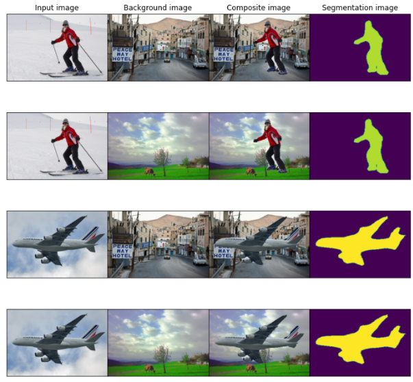

# 画像合成タスク    

---
実行結果:  
  
  
  
---
  
---  
使い方:   
1. メインとなる画像と背景画像を`./img`配下に保存する  
2. コマンドを実行する  
  
`label_list`引数にはメイン画像で認識させたいラベル名をリスト形式で指定して実行してください。  
  
```
['__background__', 'aeroplane', 'bicycle', 'bird', 'boat', 'bottle', 'bus',
 'car', 'cat', 'chair', 'cow', 'diningtable', 'dog', 'horse', 'motorbike',
 'person', 'pottedplant', 'sheep', 'sofa', 'train', 'tvmonitor']
 
```
  
```
$ python3 predict.py img_path1 img_path2 label_list
Downloading: "https://download.pytorch.org/models/deeplabv3_resnet50_coco-cd0a2569.pth" to /home/.cache/torch/hub/checkpoints/deeplabv3_resnet50_coco-cd0a2569.pth
100%|████████████████████████████████████████████████████████████████| 161M/161M [01:55<00:00, 1.46MB/s]
  return torch.max_pool2d(input, kernel_size, stride, padding, dilation, ceil_mode)
result/img4cに画像を保存しました。
```
---  

注釈: 開発コードは[こちら](./notebook)から参照する。  
